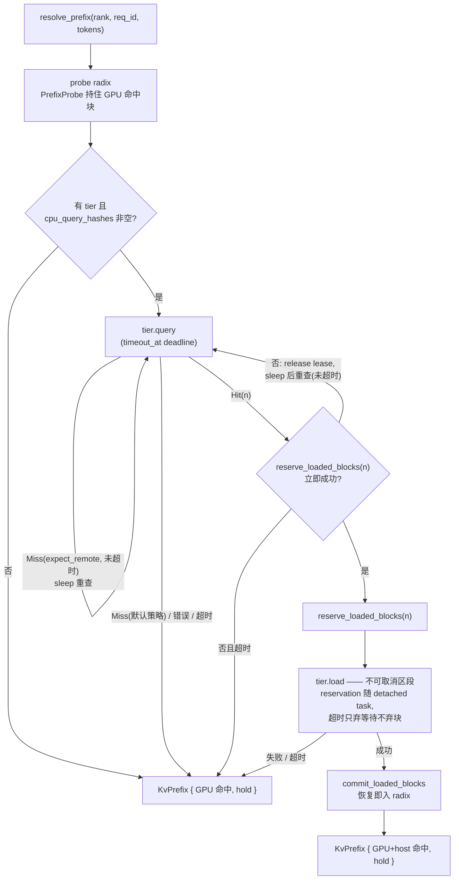

# KV cache 统一设计：pegainfer-kv-store

**TL;DR**: 异构 KV（full attn / MLA / SWA / linear state）统一为「组 + checkpoint」模型；`pegainfer-kv-store` 收编 qwen3/glm52 各自手写的 offload 编排（resolve/seal/retire 三动词 + 单一 KvPrefix 终态），模型侧只声明 `KvModel`（spec/arenas/repack）。骨架已落地且**自包含**（直连 `kvbm-logical` + `pegaflow-core`，不再依赖 `pegainfer-kv-cache`/`pegainfer-kv-offload`；测试为真 GPU/SSD 引擎套件，无 mock）。qwen3 首迁验证接口，glm52 验证 P/D，qwen35 验证 bounded 组。

Last touched: 2026-08

## 北极星

新模型 release 当天，给 agent 一页 KV 契约文档（`KvModel` 的三件套怎么填），它能独立完成该模型的 prefix cache + offloading + P/D 接入。分配、索引、checkpoint、租约、异步管线、可观测性全部是 core 机制，模型作者一行不碰。

先例文档：logical/physical 分层见 `../runtime/kv-cache-design.md`（仍然准确，`BlockPool` 就是它的产物）；pegaflow 集成见 `../runtime/pegaflow-offload-integration.md`。本文在其上定义统一的编排层。

## 语汇与不变量

### 两类存储语义，按「封存（seal）」二分

| | 增长 | 封存方式 | 共享 | 代表 |
|---|---|---|---|---|
| **Paged append-only** | 随 token 线性增长 | 页写满原地即封，封后永不改写（免费） | `ImmutableBlock` Arc 共享、radix 前缀复用 | full attn、MLA latent |
| **Bounded mutable** | 固定预算，每 token 原地改写 | **seal-by-copy**：D2D 拷到 staging，副本即 sealed artifact（付一次拷贝） | 活状态永不可共享，只能拷 | linear state（KDA/GDN）、SWA ring、conv_state、DSpark aux |

SWA 与 linear state 是同一等价类（bounded mutable）：qwen35 的 `LayerRecurrentState` 里 `conv_state` 就是一个 W=k-1 的迷你滑窗，与稠密 state 同槽同生命周期。Gemma4 的 SWA 只是更大的同类。

关键推论：**pin（防 reuse-after-free）对 paged 组足够，对 mutable 组不够**——异步 save 会与下一步的原地改写竞态，所以 mutable 组必须 seal-by-copy 后才可下存。

seal-by-copy 有两个正交维度。**对齐是机制约束**：拷贝必须落在 step 边界之间——kernel 原地写 state 期间不可快照。**频率是策略**：只在策略触发存储时才拷（每数百 token / turn 边界 / retire / P 侧 handoff），并非每个 step 边界都拷。bounded 组的封存有拷贝成本，触发频率因此天然比 paged 组稀——这与单索引「以最稀疏 checkpointer 为准」自洽：索引条目只存在于 bounded 快照点，paged 组封得更密对命中无贡献。成本量级：qwen35 state 49 MiB/请求，D2D 十几微秒；可走 copy-engine 侧流，用 event 保证「拷完才允许该 slot 下一步改写」，不阻塞 step。

### Checkpoint

> 在 token 边界 t，物化「该请求所有组的 sealed artifacts 集合」，以前缀 hash 索引。

- prefix cache 命中 = checkpoint 恢复；offload = checkpoint 换存储层级；**P/D handoff = P 在请求末尾强制打 checkpoint、D 从它恢复**（store-based P/D，非 transfer-based）。
- **单索引，以最稀疏的 checkpointer 为准**（混合模型即 linear 边界）。显式 trade-off：放弃 full 层独立细粒度命中——恢复必须从 linear 边界重算，forward 一跑所有层 KV 重生成，超出边界的 full 页保存是纯浪费。此为有意决策，记录在案以防后续被当作缺失的「优化」重新引入。
- 何时打 checkpoint 是**策略**（每 N 页 / turn 边界前端 hint / P 角色请求末尾）；机制只提供 `seal(at)`。

### 对齐组（aligned groups）

同生命周期、同边界的组共享同一套 block id，各自解释 id→offset，注册 offload 时绑定搬运（分开恢复即静默腐坏）。现役先例：glm52 的 mla(656B/tok) + idxk(132B/tok) 共享 slot_mapping；native MTP L78 KV 1:1 镜像主池 id，radix 命中免费复用。**同生命周期的 paged 组不需要 GCD page size**；只有增长语义不同的组（bounded 类）才有独立分配器（slab）。

### Checkpointable 属性

判据：**hit 时该组状态可获得 = 已存储（恢复）∨ 可从 token 重算（跳过后重建）**。paged KV 可重算（forward 一跑即有）；native MTP KV 已存储（L78 镜像主池 page id，命中页上的 MTP 行就是当年一起写的——它同样吃 hidden state，却因"已存储"而与 prefix cache 共存）。反例：DSpark/DFlash 的 aux-hidden 捕获**两者皆非**——不可重算（输入 h_i 是被 hit 跳过的 target forward 的产物，从未存在），也没存（池外 dense scratch，无 page id 无 hash 身份）→ `checkpointable: false`，存在该组时强制关 prefix cache（今天的隐式全局开关变成描述符上的显式属性）。远期：把草稿 KV 改造成对齐 paged 组（照抄 native MTP）即可翻转为 true，消掉"开投机丢 prefix cache"的互斥税。

## 架构

### 模型侧：`KvModel` 契约

```rust
/// 组结构：build 时声明一次，之后不变。
pub struct KvSpec {
    /// 池粒度（token）。v1 不变量：所有 Paged 组共享同一 page_tokens 与同一套
    /// block id（对齐组）；需要第二种页粒度 = 需要第二个池，是显式的未来扩展。
    pub page_tokens: usize,
    pub groups: Vec<GroupSpec>,
}

pub struct GroupSpec {
    // 分期契约：字段随首个消费者落地，此处为完整目标形态。
    // name/checkpointable/optional @ qwen3 首迁；sharding @ glm52 D 侧；
    // kind @ qwen35（首个 Bounded 消费者）。trait 只有模型 crate 实现，
    // 后加字段是一次性机械改动——无人消费的字段不提前进代码。

    /// 身份：store schema 命名空间与 arena 归属的连接点。
    pub name: &'static str,
    /// Paged（页写满原地封存）| Bounded（seal-by-copy）。三个消费者：
    /// 分配器（pool/slab）、封存路径、checkpoint 索引（bounded 定义快照
    /// 边界）——全部随 qwen35 迁移出现，字段届时才落地。
    pub kind: GroupKind,
    /// Replicated：rank0 存、任意 rank 恢复（MLA latent、qwen35 GDN——glm52
    /// 今天的共享 namespace 就是此语义）；PerRank：各 rank 存取自己的分片。
    /// 首个消费者是 glm52 D 侧的存储去重，字段届时落地。
    pub sharding: Sharding,
    /// 见「Checkpointable 属性」。构建期判定一次、engine 生命周期常量：
    /// enabled = !cli_no_prefix_cache && all(groups.checkpointable)。
    /// KvSpec 反映启动配置而非模型线常量——glm52 只有 --drafter dspark 启动
    /// 时 spec 里才有 dspark 组；native-mtp 启动时无此组、cache 保持开。
    /// OFF 落在三处：resolve 短路、admission 不 match、release 标记 reset
    /// （不进 inactive cache，存了也无人可 match）。
    pub checkpointable: bool,
    /// checkpoint 的原子性边界：本组 artifact 缺失时，用剩余部分是正确性
    /// 问题（false，如 idxk——执行期被主路径读取，缺失即静默腐坏，组与
    /// 主缓存构成 all-or-nothing 单元）还是性能问题（true，如 MTP——只被
    /// 可缺省的辅路径消费，缺失仅退化）。跨组数据依赖是执行期事实、仅模型
    /// 可知，故为显式声明。消费者：恢复端完整性谓词
    /// hit_valid = ∀ 非 optional 组均在场；P/D 两侧组集合按名求交的合法性
    /// 亦由它保证（差集必须全 optional）。
    pub optional: bool,
}

pub trait KvModel {
    fn spec(&self) -> KvSpec;
    /// 物理登记：(组, arena) 对——一层可有多个 arena，一组可跨多层。
    /// Arena 描述用 `pegainfer-kv-store::ArenaSpec`
    /// { name, base_device_ptr, size_bytes, num_blocks, segment_bytes,
    ///   segments, kv_stride_bytes, block_stride_bytes }（glm52 `kv_arenas()`
    /// 与 qwen3 fused-buffer 逐层视图都是其真子集；`segments`/`kv_stride`
    /// 覆盖 K/V 分段布局）。Bounded 组同样表达：num_blocks = slot 数、
    /// segment_bytes = slot 字节、stride = slot 步长。
    fn arenas(&self, rank: usize) -> Vec<(GroupId, ArenaSpec)>;
    /// 仅当 store schema ≠ 执行 layout（glm52 TP4 生产侧 576B→656B wire）。
    fn repack(&self, group: GroupId, dir: RepackDir, io: RepackIo<'_>) -> anyhow::Result<()>;
}
```

**字段审计**（判据：谁消费、改变什么决策；无消费者即删）——被砍掉的三个：

| 被砍字段 | 为什么 |
|---|---|
| `Paged{bytes_per_token}` / `Bounded{bytes_per_slot}` | 与 `arenas()` 的 `bytes_per_block` 重复——物理字节的唯一真相在 arena，spec 复写一份就是漂移源 |
| `aligned_with: Option<GroupId>` | v1 不变量「所有 Paged 组皆对齐（共享池 id）」使其恒为真 → 零信息；降级为文档不变量 |
| `HeadSharded { heads }` | 唯一消费者是异构 TP 重分片，v1 无此消费者；重分片落地时再加，先二值化为 `Replicated \| PerRank` |

**实例化**：

```rust
// qwen3 —— 最小 case：单组。
KvSpec { page_tokens: 16, groups: vec![
    GroupSpec { name: "kv", kind: Paged, sharding: PerRank, checkpointable: true, optional: false },
]}
// arenas(rank)：fused KvBuffer 的 36 个逐层视图（今天 Registration::from_buffer 产物原样）：
//   ("kv", ArenaSpec { name: "qwen3.L{n}", base_device_ptr: buf + n·layer_bytes, size_bytes,
//                      num_blocks, segment_bytes: layer_stride·2B, segments: 1,
//                      kv_stride_bytes: 0, block_stride_bytes: page_stride·2B })

// glm52 —— 多组 + optional + 非 checkpointable。
KvSpec { page_tokens: 64, groups: vec![
    GroupSpec { name: "mla",    kind: Paged,   sharding: Replicated, checkpointable: true,  optional: false },
    GroupSpec { name: "idxk",   kind: Paged,   sharding: Replicated, checkpointable: true,  optional: false }, // 缺失即腐坏
    GroupSpec { name: "mtp",    kind: Paged,   sharding: Replicated, checkpointable: true,  optional: true  }, // D 可无 MTP
    GroupSpec { name: "dspark", kind: Bounded, sharding: Replicated, checkpointable: false, optional: true  },
]}
// arenas：78×("mla",·) + 21×("idxk",·) + 2×("mtp",·)——今天 kv_arenas() 原样加组标签。
// repack：TP4 生产侧 FlashInfer 576B → wire 656B（今天 MTP transfer_cache 手写的就是此钩子）。

// qwen35（未来）—— Bounded 组首发；state + conv_state 同组两 arena。
KvSpec { page_tokens: 16, groups: vec![
    GroupSpec { name: "kv",  kind: Paged,   sharding: PerRank,    checkpointable: true, optional: false }, // 8 full 层
    GroupSpec { name: "gdn", kind: Bounded, sharding: Replicated, checkpointable: true, optional: false }, // 49.125 MiB/slot
]}
// gemma4：kv(Paged, full 层) + swa(Bounded ring, W·bytes/slot)——照抄 qwen35 形状。
```

### Store 侧：`KvStore` 具体类型（不是 trait）

进程内一个，`Arc` 共享；持有 pegaflow client + I/O runtime + checkpoint 索引 + 每 rank 的 `{ Arc<BlockPool>, host tier }`。**rank 注册在构建期**，build 后 rank 表冻结（读路径免锁）：

```rust
let store = KvStoreBuilder::new(runtime_handle)   // 旋钮全链式,无 options 结构体可 churn
    .with_resolve_deadline(Duration::from_secs(15))
    .rank(0, pool_only_rank)                       // 无 tier:同一 API 的纯 GPU 模式
    .rank_with_offload(1, pool1, &host, offload_spec)  // Err 于几何非法,rank 表永不半成品
    .expect("rank registration")
    .build();                                      // rank 表冻结,读路径免锁
// host 一手: `PegaflowHost::builder(pinned_pool_bytes).ssd_cache(..).p2p(..)`。
// glm52 迁移时把 BlockPool 构建从 engine 线程提到 spawn 之前：pool_blocks 在
// Glm52EngineSpec 里本就先于 spawn 已知，BlockPool::new 是纯 CPU 对象，无线程亲和。

impl KvStore {
    async fn resolve_prefix(&self, rank, req_id, tokens, scope, policy: ResolvePolicy, cancel) -> KvPrefix;
    // ResolvePolicy::default().wait_for_full_hit()：调用方无法重算 miss（P/D
    // decode，admission 断言 hit == committed_len）时的一体两面——tier query
    // 走 all-or-nothing（pegaflow wait_for_full_prefix，部分命中无用），且
    // Miss = 生产方注册未落地、deadline 内继续等（qwen3 wait_on_miss 收编）。
    // 默认 Miss = 冷，即刻收束。Policy/Scope 均为链式 setter + 私有字段，
    // 加字段不 churn 调用点（分期契约）。
    fn seal(&self, rank, kv: &RequestKv, cursor: &mut SaveCursor, class: SaveClass);
    fn retire(&self, rank, kv: RequestKv, cursor: SaveCursor, class: SaveClass);
    fn pinned_blocks(&self, rank) -> usize;   // admission 预算的扣项(在飞 save 钉住的页)
    async fn flush_saves(&self, rank);        // 可见性 barrier:返回即先于它提交的 save 全部可查询
}
```

- **`resolve_prefix` 是整条读链路**，**终态恰好一种**：`KvPrefix { hit_tokens, hold }`。降级（超时/悬死/池压力）只进 stats，不进类型——不改变调用方控制流的信息不配进返回类型。P/D 侧 `hit_tokens < committed_len` 这个数字即全部信息。恢复走"装回 radix 再自然 match"（qwen3 已验证的模式）。



任意 op 之间观察到取消（`token_tx` 的 abort 原子）→ 释放已持租约、返回 `KvPrefix::none()`，死请求死在 admission 现有的 `is_closed` 检查处。
- **`seal`/`retire` 是写链路**：`SaveClass::Cacheable` fire-and-forget（丢的只是未来命中）；`SaveClass::Handoff` 必达带租约（P 存的 entry 在 D 取走前不可逐出——eviction 在 store-based P/D 下是正确性问题，8 GiB 打穿 + 15s deadline 事故的教训）。retire 收编三处手写变奏（qwen3 flush barrier、glm52 `save_sealed_on_release` 先存后放、`detach_tail_save` 停放）：seal 尾部 → 有未决 save 则整个 KV 随 save 停放，settle 后 RAII 归还。
- **背压恒等式**：飞行中 save 钉住的页从 admission 预算里扣（`pinned_blocks`，glm52 现状收编），两类 save 同一口径背压，**永不 block decode**。Handoff save 失败：计数 + 大声报错、块照常归还——对端以 hit 短缺观察到缺失并拒绝 handoff；P 侧"扣住 KV-ready 响应直到 save 确认"（glm52 flush-on-finish 语义）的接线随 P/D 迁移落地。

### 请求管线：线性所有权链

请求整体 move：bridge → resolve task → rank 收件箱 → scheduler，无一段共享：

```rust
// bridge：收到 EngineCoreRequest，组装 GenerateRequest。req 自此线性 move。
let rank = req.data_parallel_rank.unwrap_or_else(|| handle.least_loaded_partition());
req.data_parallel_rank = Some(rank);               // 先绑定：hold 钉的是 rank 上的块，
                                                   // resolve 与路由必须同 rank（KvPrefix
                                                   // 携带 rank，submit_resolved 按它路由，
                                                   // 与绑定不一致触发 debug_assert）
tokio::spawn(async move {
    // 本任务独占 req；取消 = req.token_tx 上的共享 abort 原子，没有消息追靶。
    let prefix = store
        .resolve_prefix(rank, req_id, &req.prompt_tokens, scope_of(&req), policy, &req.token_tx)
        .await;                                    // 终态唯一；降级只进 stats
    let _ = handle.submit_resolved(req, prefix);   // move 进 rank 收件箱（按 prefix.rank 路由）
});

// scheduler（同步线程，per-rank）：收件箱里只有就绪请求，之后无异步。
while let Ok((req, kv_prefix)) = submit_rx.try_recv() {
    if req.token_tx.is_closed() { continue; }      // 死请求死在原地，hold 随 drop 释放
    let mut kv = pool.new_request(req.prompt_tokens.clone(), req.max_tokens, salt);
    let cached = kv.match_and_add_prefix(&pool)?;  // 自然吃到 resolve 恢复的块
    drop(kv_prefix);                               // hold 使命完成：防逐出窗口闭合
    // ... admission 预算（usable −= store.pinned_blocks(rank)）、占 slot、
    //     TokenEvent::Scheduled { cached_tokens: cached }
}
```

- store 不认识 engine/收件箱/`GenerateRequest`——它的词汇只有 token 前缀进、`KvPrefix` 出；路由留在 `EngineHandle`（已有职责）。
- **消灭队头停车**：今天 glm52 的 `HostRestoreState::poll_front` / `NativePdState` Park 是 push_front + break，一个请求等 restore 堵死整 rank FIFO。resolve 前置后 scheduler 收件箱里只有就绪请求。
- **取消 = 已有的共享原子**（`TokenSink::is_closed`，`abort_reason: Arc<AtomicU8>`），不新增机制。resolve task 在 op 之间观察；**已提交的 DMA 是不可取消区段**（guard 陪 op 走到 settle，即 `handle.rs` 现有的 detach 语义）。取消的请求返回空 KvPrefix，死在 admission 现有的 `is_closed` 检查处。
- **池的并发事实**：kvbm `BlockManager` 内部同步（save guard 已跨线程 drop），跨线程分配不是安全问题而是仲裁问题。存在**两个分配器，权限不同**：admission 的 lifetime 预留是权威（honor-or-reject）；resolve 的 reservation 是机会主义（买一段更便宜的 prefill），且分配必然晚于 query——目标页数 n 只有 `Hit(n)` 返回后才可知，而 GPU probe 本身零分配（命中块已驻留，仅加引用）。骨架期仲裁被有意拿掉：resolve 与调度器在池上平等竞争，拿不到即释放租约重试（不构成饿死风险，因为 prefix 恢复零义务、可以让步）；resolve 向 admission 让步的仲裁机制推迟到模型迁移期回归，形态见「未决」。**池装不下时等待而非即刻降级**：装不下前缀的池同样过不了该请求的 admission——横竖要等，等待买到廉价 prefill，降级买到全量重算。等待期间释放租约（host pin 与 TTL 不陪等），deadline 兜底活锁，超时才降级。对偶义务：**admission 须把 resolve 已命中的块记为该请求已持有、从 need 抵扣**（qwen3 `prefetched_blocks` 先例）——否则压力下双重计数（available 已因 hold 减少、need 又全额计）导致错误 defer。

### Scheduler 的接触面（全同步，共四处）

收件箱 recv `(req, prefix)` / admission 读 `pinned_blocks` + 更新水位 / 边界处 `seal` / 退休时 `retire`。`deferred_releases` 这类 graph-replay 生命周期是 step 语义，**不进** KvStore。

## 可观测性纪律

所有异步任务带 request id + 阶段，**终态（成功/降级/失败）必须汇报 sink，禁止 silent drop**。logging 是打印 sink、metrics 是聚合 sink、tracing 是阶段换 span——皮后补，骨架现在定型。「ttft > 50s 是哪段慢」= resolve 各阶段终态有记录。

## 迁移计划（绞杀式，每步合 main、bench 全绿、删旧码）

1. ✅ 本骨架 PR：文档 + `pegainfer-kv-store`（resolve/seal/retire + `PegaflowHost`/`ArenaSpec` pegaflow 接线 + SSD/P2P，paged only；测试为真 GPU/SSD 引擎套件，无 mock）+ 分发层 `(GenerateRequest, KvPrefix)`（未迁移模型收 `KvPrefix::none()`，行为零变化）。
2. qwen3 首迁：`resolve_prefix` 替换 `remote_fetch_action` 状态机（executor.rs ~2000 行 prefetch 编排），旧路径留开关至 bench 对齐。
3. glm52 D 侧：收件箱替换 `HostRestoreState`；随后 P/D `Handoff` 租约（对齐 pegaflow `QueryLeaseId` 语义后定稿）。#812（EP32 生产设计点）仍 open、阶段性 PR 持续落 main 且常动 scheduler/offload 邻域——迁移分支以 main 为基准高频 rebase，避免累积大 diff。
4. qwen35：`core::kv_pool` → `BlockPool` 迁移（独立，可并行开工）；然后 Bounded 组 slab + seal-by-copy 首发（唯一的新物理能力，由从零接入的模型验证）。gemma4 照抄。

## 未决

- `Handoff` 租约的超时回收与释放时机（D fetch 完成即释放 vs admission 断言通过才释放）——防腐层里对 pegaflow lease 语义定。同族未定项（均随 glm52 P/D 迁移落地）：mutable tail page 的保存动词——tail 页未封存、以 SHA-256(committed prompt + anchor) 为 key、携 draft tokens 的 `KvTransfer` 信封；store 的 seal/retire 只认已注册块，尚无「按任意 key 保存一块」的 API。
- miss-breaker（连续冷 miss 停止 park）是跨请求策略，qwen3 迁移时决定放 store 还是 scheduler。同日归属待定：运行时 prefix_cache 开关的收编（resolve 短路 / admission 不 match / release 标记不进 inactive cache）。
- 仲裁机制归位：骨架期的 `set_admission_floor`（store 侧原子水位）已删——无人消费的水位是臆造接口。回归时建议形态是「admission 自管预算」：resolve 已命中块的抵扣（`prefetched_blocks`）与 reserve 记在 admission 同一本账（qwen3 `reserve_floor` 先例），不恢复独立水位 API。TOCTOU 收口（池内 `async reserve_blocks(n)`，waiters 挂在唯一真相旁）随此一并议——外挂信号量镜像可用量会造第二本账，且块非同质 permit（free vs warm-evictable、分配顺序影响命中率），信号量语义只属于分配器内部。
- resolve 的 key 方案：**vLLM P/D 互通将整体移除**（独立后续 PR；清单：`vllm_compat` 状态机、`VllmBlockHasher`（xxh3_128 CBOR 链）、`miss_wait` 窗口、`page_first` 注册模式及其测试），故不为外部 hasher 抽可插拔 seam；glm52 的 SHA-256 tail key 随 native P/D 迁移以单一消费者定形。
- repack 钩子（`KvModel::repack`）设计保留、骨架不落：唯一消费者是 glm52 TP4（FlashInfer 576B 执行态 ↔ 656B wire），待 TP4 P/D 互通有真实对端时随消费落地。
- pegaflow fork 与否：防腐层（crate 内 `HostTier`）稳定运行后再议；`Loading` 的轮询套轮询是第一改造对象。

**Next**: qwen3 首迁 PR（迁移计划第 2 步）。
