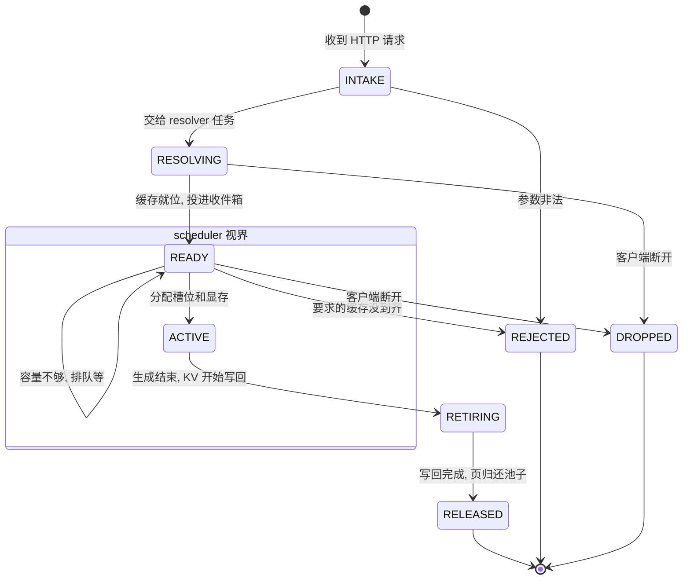

# Resolver 所有权与 native tail 定形：#830 的教训与后继设计

> **TL;DR:** #830（glm52 迁移 pegainfer-kv-store）八轮评审 18 条 finding 的复盘结论：**plain 路径符合 design.md 的双分配器模型，偏航只在 native P/D 路径**——它把权威级分配（RequestKv 生命周期、keyed tail 装载）放进了 resolver 任务，破坏了"resolve 分配零义务、可让步"的前提；评审补出的 HeadroomLedger 恰是 design.md 明文警告的"第二本账"。后继 PR 的设计：① native full 页改走 radix-first（与 plain 同路，零义务）；② **keyed tail 用 pad-to-boundary 消灭**（save 本就按块粒度运整页 slab，padding 零字节代价，换来 radix 身份 + 失败前置到 admission 之前）；③ 仲裁按 design.md 未决预定形态归位（池内 async reserve + admission 侧 prefetched 抵扣），台账族与 keyed API 族整体删除。#830 冻结为记录，其 20+ 契约测试作为后继的行为验收标准。
>
> Status: 设计评审定稿（含 §五 状态机与 scheduler 结构）。phase-1（kv-store 面，#840）已合入；phase-2（glm52 迁移）实现中。前置阅读：`design.md`（尤其「请求管线：线性所有权链」与「池的并发事实」）。

## 一、#830 十八条 finding 的归因

| 类 | 代表 finding | 根因 |
| --- | --- | --- |
| 容量竞态(~9 条) | native 互饿死锁、headroom claim 生命周期、probe pin 绕账、plain 记账非原子、tail 一次性分配 | native resolver 持有**不可让步的权威级分配**,与调度器在池上竞争 |
| 异步所有权(~5 条) | keyed-tail 无界等待、lease 泄漏 ×2、取消不穿透 | `timeout_at` 丢观察者不丢工作;其中 lease-settle/DMA-parking 是 design.md 230 行本就要求的「guard 陪 op 走到 settle」,#830 初版漏实现 |
| 删掉的防御 | 匿名 key 序号、resolver 负载可见性、tail 等待语义 | 旧串行状态机的行为被当实现细节丢弃(见 conventions 待立项:迁移防御清单) |
| 真边界 | handoff 静默降级、teardown arena UAF | 与所有权正交,修复直接继承 |

**关键对照**:design.md 231 行早已定义了权限模型——admission 的 lifetime 预留是**权威**(honor-or-reject),resolve 的 reservation 是**机会主义**(恢复的是 radix 共享缓存块,零义务、拿不到就让步);仲裁被有意推迟,未决 252 行连回归形态都写明,并警告「外挂信号量镜像可用量会造第二本账」。#830 的 native 路径在 resolver 里 `pool.new_request` + schedule 生命周期 + tail 装进私页——私产不可让步,模型前提崩塌;评审八轮随后补出的 debt 台账正是被警告的第二本账。**补丁的形状(影子记账、锁内 verify-and-book、cancel 穿针)就是架构报警**。

## 二、后继设计

### 2.1 plain 路径:照抄 #830 现状(它是符合设计的)

resolve task 线性持有 req:probe hold(RAII,零分配)→ guarded tier query(lease 必达 settle)→ 机会主义 reservation(可让步)→ load(已提交 DMA 不可取消,reservation 随 detached task)→ commit 入 radix → 投递 `(req, KvPrefix{hold})` 给 scheduler 收件箱。权威分配只发生在 admission。

继承自 #830 的修复:`LeaseGuard`/`spawn_guarded_query`(迟到命中的 lease 自动释放)、load 的 detach 语义与 `flush_loads` 排水、`PrefixProbe::truncate_held`(hold 与 credit 钉页对齐)、resolver 负载可见性思想(waiting = pending + inflight)、handoff 能力不匹配显式拒绝、teardown 排水超时泄漏 worker。

### 2.2 native P/D:radix-first + pad-to-boundary

**full 页**:D 的恢复就是一次 `wait_for_full_hit` 的 `resolve_prefix`——零义务共享块,admission 断言命中长度并做全部权威分配。resolver 里不再出现 RequestKv。

**tail(committed_len % 64 的半页)**:三不状态(不可封存/无 radix 身份/必须落私页)曾催生 keyed 旁路 API。定形:**P 侧 pad 到页边界,命名链 = `prompt + 纯 pad id`,anchor 不进任何 hash**。

- P:半页用词表外保留 pad id 补满命名链 → 页封存,正常 Handoff-class save。**零字节代价**:save 按块粒度搬运,半页的 slab 本来就整页在运;padding 只是给垃圾行一个名字,换取 radix 身份。pad id 在词表外 + 既有 `native_mtp_cache_salt` 域隔离:plain 匹配用未 pad 链,天然撞不上 pad 页。committed_len 整除页时零 pad。
- D resolver:从 `prompt + committed_len` 重建同一条 pad 链(不走线),一次 `resolve_prefix`(`wait_for_full_hit` + `full_pages`)恢复全部页——零义务共享块,resolver 里无 RequestKv。
- D admission(native 臂):断言全命中;padded 边界页 **copy-on-restore** 拷进请求私页——decode 从 committed_len 处 append 会写进该页,共享块不可写(对齐组全家一起拷:mla+idxk+MTP L78 镜像,~3.3MB D2D,worker 首步 prologue 执行,调度线程无 CUDA stream)。整除时 decode 从新页起笔,无拷贝。attention 被 seq_len 界住,读不到 pad 行。
- **anchor 移位行:接受碰撞**。MTP 草稿头错一位,其镜像在 `committed_len-1` 的行需要 anchor 的 embedding——共享内容中唯一非 prompt 纯函数的行,声明为已知模糊,不设补救机制。碰撞窗口 = 同 prompt + T>0 采出异 anchor + 旧页存活于任意缓存层(host tier 亦按 hash 去重,存留小时级);伤害仅为受害请求的草稿命中率微损,逐 token 验证兜底,不碰输出正确性。T=0 免疫(anchor 必同);turn-2 复用时该行对真实续写恰好正确(下一 token 即当时的 anchor)。否决项:① D 侧清零——K=0 行以 logit-0 持续稀释此后所有 draft 注意力,每请求都付,比碰撞更贵;② 信封运行真值——逐位无损,但 +1 个 ~KB 数据字段;accept-rate 实测退化时的现成升级路径;③ anchor 进 pad 链——覆盖不了整除情形(污染行在无 pad 槽的满页里)。
- 失败语义:padded 页缺失 = 命中短缺 = **admission 拒绝,发生在占 slot 之前**,router 兜底。(对比曾考虑的"admission 后再取 tail":取回失败发生在 slot 已占之后,15s deadline × slot 数是存储抖动即冻结整 rank 的 DoS 面;及"D 重算尾巴":每请求 ≤63 行 context 挤进 decode 步流,c64 突发时 ~2000 行,违背 PD 分离的 decode 纯度——均否决。)
- turn-2 prefix 复用终止在最后一个真 full 页,与现状一致,无损失。

### 2.3 仲裁归位(design.md 未决 252 行的预定形态)

- 池内 `async reserve_blocks(n)`:waiters 挂在唯一真相旁,TOCTOU 在分配器内部收口;
- admission 自管预算:resolve 已命中块按 `prefetched_blocks` 抵扣(qwen3 先例),不设独立水位 API,**不建第二本账**。

### 2.4 handoff 信封 v3(评审已决)

划界原则:**prompt 纯函数走 KV 数据面(可共享页),anchor 依赖的续跑状态走信封**。收敛为一个收发两侧共用的 `Serialize + Deserialize` 结构体(v2 是发送侧 `json!` 字面量 + 接收侧独立 `Deserialize` 结构,两边靠字段名字符串耦合):

| 字段 | 语义 |
| --- | --- |
| `fingerprint: String` | 人可读能力清单,如 `"glm52-native-mtp/3/arenas:101/page:64/salt:pages-v2/drafts:N"`;不匹配整串进拒绝日志,自带诊断。吸收 v2 的 `version` + `arena_count`,协议演进 = 改这个串 |
| `committed_len: usize` | 恢复的锚:admission 预算、pad 链重建、copy-on-restore 偏移、decode 起点 |
| `anchor_token_id: Option<u32>` | P 采样的首 token:D 的首步输入,且由 D 重放给客户端(router 只播 D 的流)。`None` = P 首采即 EOS——D 不恢复不 decode,直接 Stop 收尾。吸收 v2 的 `anchor_emitted`(其真实语义即 anchor-是否-EOS,名字曾误导) |
| `draft_tokens: Vec<u32>` | P 的 MTP 草稿,D 首步直接验证 |

退役无接班字段:`tail_len`(几何可由 committed_len 推导,含"整除补整页"怪癖)、`tail_key`(身份走 radix padded-hash)。否决:`boundary_page_hash` 一致性指纹——fingerprint 已挡约定漂移,同版本实现分歧属 bug,过度防御。接受形状唯一化:router 转发原始 prompt token ids、D 重放 anchor;v2 的"manual harness 已拼 anchor"双形状删除。未上线,无兼容窗口约束。

## 三、kv-store 变更清单(相对 #830 尖端 d303852)

| 处置 | 内容 |
| --- | --- |
| **保留** | `LeaseGuard`/`GuardedQuery`/`spawn_guarded_query`;load 的 detach+`flush_loads`;`truncate_held`;mock tier 测试基建;`seal`/`retire`/`flush_saves` 主干 |
| **删除** | `HeadroomLedger` 族(`assume_active_headroom`/`with_headroom_sync`/`settle_headroom`/`schedule_prefill_resolver` 门)、`reserve_headroom`、store 内 `CancelProbe` 穿针、**keyed 族**(`seal_keyed`/`resolve_keyed_block`/`KeyedFetchError`/`KeyedLoadParking`) |
| **重塑** | 池内 async reserve(waiters);admission 侧 prefetched 抵扣;P 侧 pad-and-seal(落在 glm52 P 逻辑)。store 新增两处:`ResolvePolicy::full_pages`(D 侧解析含边界页的 pad 链)与 `RequestKv::pad_to_boundary()` + `pub const PAD_TOKEN_ID: u32 = u32::MAX`(P 侧命名链补齐;无参——pad id 是 P/D 必须逐位一致的命名约定,常量即单一事实源;只动命名链不产生计算,调用后尾块带 immutable guard 走正常 seal,v2 的 `tail_saves` 停放机器随之退役) |

破坏性变更成本:零——`pegainfer-kv-store` 当前唯一消费者是 glm52。

## 四、验收与迁移

- **行为验收 = #830 的契约测试全集**(互饿不可形成、resolver 不搁浅 active、取消及时释放、lease settle、parking、handoff 拒绝、teardown 泄漏……),机制换、断言不换;keyed 族测试随 API 删除,由 padded 路径的新契约测试接棒(padded 页缺失拒绝、copy-on-restore 对齐组完整性、pad 行不可见)。
- 后继实现 PR 基于 main 重做(不基于 #830 分支);#830 冻结为设计论证记录。
- 真机验收:1P1D+router 复刻 #830 迁移时的验收矩阵(GSM8K n200、multi-turn c16 头对头、240/240 零失败)+ c64 全量 trace 回放(#833 战役的 harness 现成)。

## 五、请求状态机与 scheduler 结构(评审已决)

### 5.1 状态机

- RESOLVING 无"请求"级分配:产出只是把缓存块填进 radix(公共块)+ 一个防踢 hold。权威分配集中在 READY → ACTIVE 一条边(honor-or-reject,含 output 增长的私有页与槽位;命中前缀只转引用,预算按 prefetched 抵扣)。
- native 特殊点仅两处:READY → REJECTED(P 页必须全命中,缺页在占槽之前拒,router 兜底);边界页 copy-on-restore 在 worker 首步 prologue 做(~3.3MB D2D;调度线程无 CUDA stream),ACTIVE 内一个 `boundary_copy_pending` 标记承载。
- 三个出口是请求消亡,不是状态;RETIRING 是唯一允许停放的状态(save 未落定挂在 parked 列表,不占槽)。

### 5.2 容器即状态

scheduler 不设 `state: RequestState` 枚举字段。每个状态就是"请求躺在哪个容器":INTAKE 瞬时在 engine 线程栈上;RESOLVING 由 resolver task 持有(scheduler 无感知);READY 是收件箱条目;ACTIVE 是 slot 表占位;RETIRING 是 parked 列表条目。"状态与所有权一致"由结构保证——请求同一时刻只在一个容器里;status 字段与实际位置是两本账,不设。

### 5.3 随决事项

- `ResolvePolicy` 加 full-pages 开关:现 `resolve_prefix` 的「最后一页不缓存」上限会掐掉 padded 边界页,native 臂需全页解析。phase-2 第一刀,消费者随行。
- `Resolved::Native` 瘦身为纯元数据(committed_len 等),不再携带任何分配。
- 池内 async `reserve_blocks` waiters 推迟:resolver 零义务可让步后,原互饿死锁类不存在,admission 侧 prefetched 抵扣已够;design.md 未决条目保持原状。
- P 侧 pad-and-seal 落 prefill_tp 封存路径;信封定形见 §2.4,P/D 同 PR 切换。

迁移防御清单已立项:见 `docs/conventions/migration-defense.md`。
